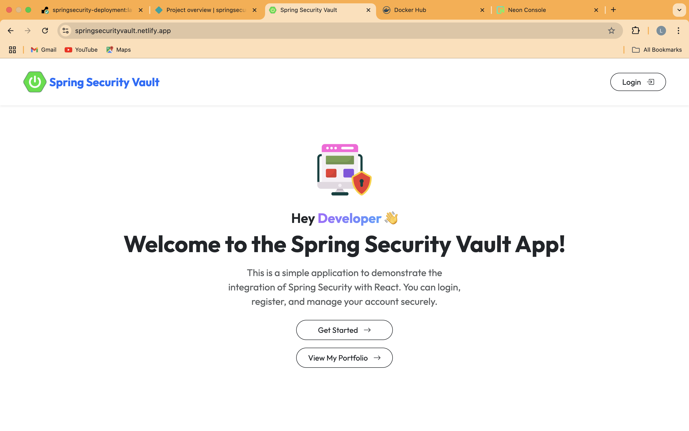

# 🔐 Spring Security Vault

A full-stack secure authentication system built with Spring Boot, React, and PostgreSQL. It uses Spring Security with JWT and OAuth2 (GitHub & Google) for authentication, includes email verification and password reset via JavaMailSender using the Brevo API, and containerized backend deployment using Docker.

## Live Demo

- **Frontend (React)**: [https://springsecurityvault.netlify.app](https://springsecurityvault.netlify.app)
- **Backend (Spring Boot)**: [https://springsecurity-deployment-latest.onrender.com](https://springsecurity-deployment-latest.onrender.com)
- **Swagger UI**: [https://springsecurity-deployment-latest.onrender.com/api/v1.0/swagger-ui.html](https://springsecurity-deployment-latest.onrender.com/api/v1.0/swagger-ui.html)

---

## Features

- JWT-based login with cookie
- JavaMailSender using the Brevo API
- User registration with email verification via email OTP
- Password reset via email OTP
- GitHub OAuth2 login
- Google OAuth2 login
- PostgreSQL (hosted on Neon Console)

---

## Tech Stack

**Backend:**
- Java + Spring Boot
- Spring Security
- Spring Data JPA
- PostgreSQL
- JWT
- OAuth2 (GitHub, Google)
- JavaMailSender using the Brevo API (OTP support)
- Swagger UI and Postman for API documentation
- Used Docker to containerize the Spring Boot project and deployed it on Render

**Frontend:**
- React
- Axios
- React Router
- Context API
- Toastify for notifications
- Deployed on Netlify

